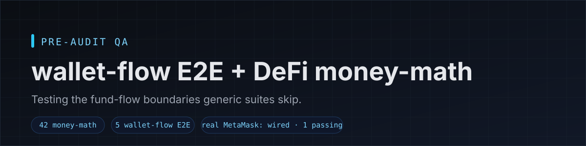

# web3-qa-starter



**Tests the flows generic suites skip — wallet-flow E2E + DeFi money-math edge cases.**

A small, readable starter that demonstrates the kind of coverage pre-audit QA for
DeFi/dApps actually needs: the exact boundaries where funds move, and the wallet
flows a mocked UI test can never reach.

→ Public write-up: **[docs/case-study.md](./docs/case-study.md)** — problem, approach, and what's in the repo.

## Why it matters

Protocol audits require evidence that **fund flows are covered** — deposit, borrow,
repay, liquidate, withdraw — including the edge cases that decide whether money is
lost. Most projects arrive with shallow UI tests and no boundary coverage, so auditors
re-derive behavior themselves and bill for it. Concrete coverage of these flows
can trim the audit bill — commonly **estimated at ~15–25%** (an industry rule of
thumb, not a guarantee) — and shortens the first review round.

## What's inside

- **Money-math edge cases** (`src/money-math/`, `tests/`) — 42 boundary tests in exact
  `bigint` (no floats), each formula verified against its spec:
  - **Aave-style health factor** — HF exactly `1e18` is solvent; one wei of extra debt flips
    it to liquidatable; zero-debt and division-by-zero handled; max additional borrow vs max-LTV.
  - **Uniswap V2** (`getAmountOut` / `getAmountIn` / `quote`) — constant-product x·y=k with the
    997/1000 fee; out rounds DOWN, in rounds UP (+1) so the pool is never underpaid; zero/empty
    reserves and `amountOut ≥ reserveOut` throw `INSUFFICIENT_LIQUIDITY`.
  - **ERC-4626 vaults** — shares/assets conversions and the `preview*` rounding matrix (always in
    favour of the vault); fresh-vault 1:1; degenerate `supply>0, assets==0` rejected; a full
    first-depositor inflation-attack scenario.
  - **Liquidation** — bonus payout and repay/seize amounts, capped at debt.
- **Wallet-flow E2E that runs out of the box** (`e2e/`) — `npm run e2e` starts a bundled
  demo dApp and drives the full flow through an injected EIP-1193 **test double**:
  connect → switch network → EIP-712 sign → send tx. Hermetic: no secrets, no network.
  A **real-MetaMask/Synpress mode is wired up** (`npm run e2e:real`): a live MetaMask
  boots and the dApp receives a genuine `isMetaMask` EIP-1193 provider. See
  [`README-e2e.md`](./README-e2e.md) for what passes and what is blocked.

> **What runs live vs. what doesn't.** `npm test` (42 money-math tests) and `npm run e2e`
> (5 wallet-flow tests against the bundled demo dApp) both pass with no setup. The **real
> MetaMask/Synpress mode is wired up** — `npm run e2e:real` boots a live MetaMask that
> injects a real EIP-1193 provider, and that test passes. What is **blocked in this
> environment** is the wallet's **connect/sign approval popups** (MetaMask's
> `notification.html` never surfaces), so those two tests are visible skips, not passes.
> A forked-mainnet run additionally needs MetaMask + an RPC key. Details in
> [`README-e2e.md`](./README-e2e.md).

## Run it

Requires Node 22+.

```bash
npm i
npm test          # 42 money-math boundary tests (vitest)
npm run e2e       # 5 wallet-flow E2E tests vs the bundled demo dApp (Playwright)
npm run typecheck # tsc --noEmit
```

Real MetaMask (forked mainnet, wallet extension): see [`README-e2e.md`](./README-e2e.md).

## Stack

TypeScript · ESM · vitest · Playwright + Synpress (real-MetaMask wallet flows: a live MetaMask
boots and injects a real EIP-1193 provider; connect/sign approval popups are blocked in this
environment) · Tenderly forked mainnet / Anvil · viem

## Hire me

Pre-audit QA for DeFi/dApps — real-wallet E2E, fund-flow and money-math coverage,
audit-ready test reports. Background: 8 years QA, iGaming money-math, Web3.

**Contact:** m.lichkovsky@gmail.com · Telegram [@skinny_white](https://t.me/skinny_white)

## License

MIT — see [`LICENSE`](./LICENSE).
